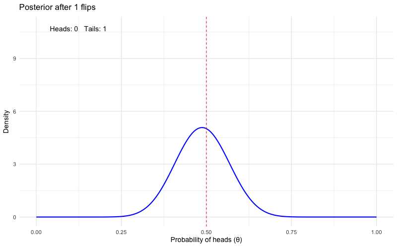

```{r}
#| label: setup
#| include: false
library(tidyverse)
source(here::here("R/setup.R"))
theme_set(theme_minimal(base_size = 18))
set.seed(705)
crimes <- read_csv(here::here("data/chicago-crimes-2025.csv"), show_col_types = FALSE)
```

## Week 2 Follow-Up

**Homework 2** — questions on central tendency, dispersion, or the distributions?

Anything from Lab 2 (ggplot) still shaky? We use every one of those tools again today.

**R4DS thread:** you read Ch. 3 (Data transformation) & Ch. 4 (Code style) — today's lab puts them to work.

## This Week

**Topic:** Essentials of probability

- Outcome tables — toast drops in place of coin tosses
- The binomial distribution; generating random data
- Contingency tables: marginal, joint, and conditional probability
- A first pass at **Bayes' theorem** and base rates

**Learning goals:** reason with outcome and contingency tables; generate random distributions in R; reverse a conditional with Bayes' theorem.

**Today's rule:** don't take a probability claim on faith — **simulate it and watch it happen**.

## Two Threads, One Course

:::: columns
::: {.column width="50%"}
**Statistics thread** — lecture + homework

Stanton Ch. 2 → probability, conditional thinking, and a first pass at Bayes' theorem
:::

::: {.column width="50%"}
**Wrangling thread** — lab

R4DS Ch. 3–4 → the dplyr verbs: `filter()`, `arrange()`, `mutate()`, `summarize()`, `count()`
:::
::::

The two threads meet at the Session 7 workshop — the stats thread makes you a careful consumer of evidence; the wrangling thread is why your final project won't hurt.

# What *Is* a Probability? {background-color="#73000A"}

## Probability = Long-Run Proportion

Claim: a fair coin lands heads with probability 0.5. Don't trust me — flip some coins:

```{r}
#| label: flips-10
flips <- sample(c("heads", "tails"), size = 10, replace = TRUE)
flips
mean(flips == "heads")
```

. . .

```{r}
#| label: flips-10-again
# six more batches of ten flips each:
replicate(6, mean(sample(c("heads", "tails"), size = 10, replace = TRUE) == "heads"))
```

Ten flips is **not** the long run — batches of 10 bounce around, and none is entitled to land exactly on 0.5.

## Our Simulation Verbs, In Words

You just met the two verbs that power every simulation this semester:

- `sample()` — run one random event (flip the coins, drop the toast)
- `replicate(k, expr)` — repeat the whole recipe `k` times and collect the answers
- One run = a **trial**; many runs = the **long run**
- Later today, `rbinom()` compresses "flip six coins and count the heads" into a single call

::: aside
A plain-language reference for all the course's simulation verbs lives on the [Resources page](../resources.qmd#simulation-verbs).
:::

## The Long Run, Seen

```{r}
#| label: lln-plot
#| code-line-numbers: "1-4|5-9"
#| output-location: slide
#| fig-height: 5
lln <- tibble(flip = sample(c(1, 0), size = 100000, replace = TRUE)) |>
  mutate(n_flips = row_number(),
         running_prop = cummean(flip))

ggplot(lln, aes(n_flips, running_prop)) +
  geom_line(color = crju_colors["garnet"]) +
  geom_hline(yintercept = 0.5, linetype = "dashed") +
  scale_x_log10() +
  labs(x = "Number of flips (log scale)", y = "Running proportion of heads")
```

Wobbly early, pinned to 0.5 eventually. A **probability** is the value the long-run proportion settles on. Every probability "fact" today gets this treatment.

## Real Stakes: P(Arrest) in Chicago

Our anchor data: 30,000 real Chicago incidents from 2025. Each incident either ended in an arrest or didn't — 30,000 recorded trials.

```{r}
#| label: p-arrest
mean(crimes$arrest)
```

Pick a 2025 incident at random and the probability it ended in arrest is about **0.16** — arrest is the exception, not the rule.

*(`arrest` is TRUE/FALSE; `mean()` of a logical is the proportion of TRUEs. You'll use this trick constantly.)*

## The Long Run Works on Real Data Too

Read case files one at a time, tracking the running arrest proportion:

```{r}
#| label: lln-arrest
#| code-line-numbers: "1-3|4-8"
#| output-location: slide
#| fig-height: 5
running <- tibble(arrest = sample(crimes$arrest, size = 5000)) |>
  mutate(n_cases = row_number(),
         running_prop = cummean(arrest))

ggplot(running, aes(n_cases, running_prop)) +
  geom_line(color = crju_colors["navy"]) +
  geom_hline(yintercept = mean(crimes$arrest), linetype = "dashed") +
  scale_x_log10() +
  labs(x = "Case files read (log scale)", y = "Running proportion arrested")
```

The first few dozen cases can wander far from 0.16. Thousands pin it down. **Small samples lie; long runs don't.**

# Toast, Events, and Trials {background-color="#1B2A4A"}

## A Reality Show About Dropped Toast

Imagine a restaurant where the waiters *always* drop the food. Each order = **six pieces of toast**; each piece lands topping-**down** or topping-**up**.

- One piece of toast falling = one **event**
- One dropped order of six = one **trial**

## The Toast Data: 100 Dropped Orders

Here's data from 100 trials:

```{r}
#| label: toast-data
toast <- tibble(
  jelly_down = 0:6,
  trials     = c(4, 9, 20, 34, 21, 11, 1)
)
toast
```

## Proportions ≈ Probabilities

```{r}
#| label: toast-probs
toast |> mutate(prob = trials / sum(trials))
```

. . .

Rule #1: probabilities across **all** outcomes sum to 1:

```{r}
#| label: toast-sum
toast |> summarize(total_prob = sum(trials / sum(trials)))
```

## Simulate Your Own Toast Drops

```{r}
#| label: rbinom-demo
drops <- rbinom(n = 100, size = 6, prob = 0.5)
# rbinom() generates random trials of the "binomial distribution"
# n = 100 gives the number of trials
# size = 6 asks for six pieces of toast in each trial
# prob = 0.5 says there's an even (50:50) chance of jelly-down or jelly-up

tibble(jelly_down = drops) |> count(jelly_down)
```

Compare to the reality-show table — same shape, without filming a single waiter.

## Run It Again — It Changes

```{r}
#| label: two-runs
#| code-line-numbers: "1-4|5-7"
#| output-location: slide
#| fig-height: 5
two_runs <- tibble(
  run = rep(c("Run 1", "Run 2"), each = 100),
  jelly_down = c(rbinom(100, size = 6, prob = 0.5),
                 rbinom(100, size = 6, prob = 0.5))
)
ggplot(two_runs, aes(jelly_down)) +
  geom_bar(fill = crju_colors["garnet"]) +
  facet_wrap(~run) +
  labs(x = "Jelly-down count (out of 6)", y = "Trials")
```

Same process, different picture — **sampling variability**. 100 trials is still a shortish run. **Try running it yourself!**

## The Long Run Tames the Wobble

The "theoretical" binomial probabilities are just what the simulation converges to:

```{r}
#| label: binom-converge
#| output-location: slide
tibble(jelly_down = rbinom(n = 100000, size = 6, prob = 0.5)) |>
  count(jelly_down) |>
  mutate(
    simulated   = n / sum(n),
    theoretical = dbinom(jelly_down, size = 6, prob = 0.5)
  )
```

At 100,000 trials, simulated and theoretical probabilities agree to within a few thousandths. Theory is the long run; simulation is how we *watch* the long run.

## Cumulative Probabilities

"What's the probability of **3 or fewer** jelly-down?" Add up the outcomes as you go:

```{r}
#| label: cum-prob
#| code-line-numbers: "1-4|5-7"
#| output-location: slide
#| fig-height: 5
cum_toast <- tibble(jelly_down = rbinom(n = 100000, size = 6, prob = 0.5)) |>
  count(jelly_down) |>
  mutate(prob = n / sum(n),
         cum_prob = cumsum(prob))
ggplot(cum_toast, aes(jelly_down, cum_prob)) +
  geom_col(fill = crju_colors["navy"]) +
  labs(x = "Jelly-down count", y = "P(this count or fewer)")
```

Each bar = probability of *that count or fewer*. The last bar is always 1 — rule #1 again.

# Contingency Tables {background-color="#73000A"}

## Linked Outcomes

Now each falling piece of toast has **two** classifications: how it lands (down/up) *and* its topping (jelly/butter). Ten dropped pieces:

```{r}
#| label: toast10
toast10 <- tribble(
  ~topping, ~landed, ~n,
  "Jelly",  "Down",  2,
  "Jelly",  "Up",    1,
  "Butter", "Down",  3,
  "Butter", "Up",    4
)
toast10 |> pivot_wider(names_from = landed, values_from = n)
```

A **contingency table**: rows = one classification, columns = the other, cells = counts of events with *both*.

## Marginal Totals Answer Questions

- Total toast-drop events? How many landed down? Up?
- More likely to land down or up?
- Which topping is more common, butter or jelly?

```{r}
#| label: toast10-margins
#| output-location: slide
toast10 |> summarize(n = sum(n), .by = landed)    # column margins
toast10 |> summarize(n = sum(n), .by = topping)   # row margins
sum(toast10$n)                                    # grand total
```

The row/column sums live in the *margins* of the table — hence **marginal** probabilities.

## Super Challenge: Does the Topping Matter?

Jelly landed down 2/3 of the time (0.67); butter 3/7 (0.43). Is jelly *really* doomed — or is 10 pieces of toast just a short run? **Simulate a world where topping makes no difference:**

```{r}
#| label: topping-sim
sim_gap <- function() {
  p_jelly  <- rbinom(1, size = 3, prob = 0.5) / 3   # 3 jelly pieces, fair
  p_butter <- rbinom(1, size = 7, prob = 0.5) / 7   # 7 butter pieces, fair
  abs(p_jelly - p_butter)
}
gaps <- replicate(10000, sim_gap())
mean(gaps >= 2/3 - 3/7)   # how often does pure chance produce our gap?
```

## Super Challenge: The Verdict

Even with **no real difference**, chance alone produces a gap at least this big well over half the time. Ten drops can't answer the question.

*(This simulate-a-boring-world move is the seed of hypothesis testing — coming in Session 6.)*

## A Real Contingency Table

Same structure, real stakes — crime category × arrest, 30,000 Chicago incidents:

```{r}
#| label: crimes-xtab
crimes |>
  count(crime_category, arrest) |>
  pivot_wider(names_from = arrest, values_from = n)
```

`count()` gets the cell counts; `pivot_wider()` lays them out as the table. This is today's lab skill set doing probability work.

## Joint Probabilities, For Real

**Joint** — divide every cell by the grand total:

```{r}
#| label: crimes-joint
crimes |>
  count(crime_category, arrest) |>
  mutate(p = n / sum(n))
```

P(Property **and** arrest) ≈ 0.025 — a joint probability.

## Marginal Probabilities, For Real

**Marginal** — collapse one classification:

```{r}
#| label: crimes-marginal
crimes |> count(crime_category) |> mutate(p = n / sum(n))
```

P(Property) ≈ 0.35 — a marginal probability, next to the joint P(Property **and** arrest) ≈ 0.025 from the last slide.

# Conditional Probability {background-color="#1B2A4A"}

## The Restaurant Work Schedule

Back at the toast restaurant — hours worked by four servers:

```{r}
#| label: hours-data
hours <- tribble(
  ~day,        ~Anne, ~Bill, ~Calvin, ~Devon,
  "Monday",        6,     0,       5,      8,
  "Tuesday",       0,     6,       6,      0,
  "Wednesday",     8,     5,       0,      8,
  "Thursday",      4,     6,       5,      8,
  "Friday",        8,     8,       5,      8,
  "Saturday",      8,    10,       8,      8,
  "Sunday",        0,     3,       6,      0
)
hours_long <- hours |> pivot_longer(-day, names_to = "server", values_to = "hours")
```

Two interesting questions:

1. You sit down and **Bill** is your server. What day is it most likely to be?
2. You know it's **Monday**. Who is most likely to be your server?

## Converting to Proportions

Every cell divided by the grand total (147 hours) — the joint probabilities:

```{r}
#| label: hours-props
hours_long |>
  mutate(p = hours / sum(hours)) |>
  pivot_wider(id_cols = day, names_from = server, values_from = p)
```

But question 1 isn't about the whole table — Bill being your server **rules out** every other column.

## Question 1: Bill Is Your Server — What Day Is It?

Isolate Bill's column, then **re-scale it so it sums to 1**:

```{r}
#| label: bill-normalize
#| output-location: slide
hours_long |>
  filter(server == "Bill") |>
  mutate(p_day_given_bill = hours / sum(hours)) |>
  arrange(desc(p_day_given_bill))
```

Most likely Saturday (0.26). That renormalization — *shrink the world to the condition, then re-proportion* — **is** conditional probability, and it's the core move behind Bayes' theorem at the end of today.

## Question 2: It's Monday — Who's Serving?

Same move, conditioning the other way:

```{r}
#| label: monday-normalize
hours_long |>
  filter(day == "Monday") |>
  mutate(p_server_given_monday = hours / sum(hours))
```

Devon (0.42). Note the asymmetry: P(Saturday | Bill) and P(Bill | Saturday) are **different questions with different answers**. The direction of conditioning matters — a lot. Bayes' theorem, in a few minutes, is the formula for flipping it.

## Conditioning = filter(), Then Proportion

In real data, conditional probability is just *subset, then take the mean*:

```{r}
#| label: arrest-by-category
crimes |>
  summarize(p_arrest = mean(arrest), n = n(), .by = crime_category)
```

P(arrest | Property) ≈ 0.07; P(arrest | Other) ≈ 0.25. Knowing the crime category **changes** the arrest probability — the two variables are *dependent*.

## Conditionals Reveal What Variables Measure

```{r}
#| label: narcotics
crimes |>
  filter(primary_type == "NARCOTICS") |>
  summarize(p_arrest = mean(arrest), n = n())
```

P(arrest | narcotics) ≈ **0.97**. Is Chicago spectacular at solving drug crimes?

. . .

No — a narcotics *record* usually exists **because** someone was arrested. Conditional probabilities describe the data-generating process, not just the world. Always ask *how did this row get into the data?*

## When Conditioning Changes Nothing: Independence

```{r}
#| label: independence
mean(crimes$arrest)
crimes |>
  summarize(p_arrest = mean(arrest), n = n(), .by = domestic)
```

P(arrest | domestic) and P(arrest | not domestic) are essentially identical to the overall P(arrest) — in this sample, knowing an incident was domestic tells you almost nothing about arrest.

## Independence, Defined

**Definition:** A and B are **independent** when P(A | B) = P(A). Conditioning that moves the number = dependence; conditioning that doesn't = independence.

# Reversing the Conditional: Bayes' Theorem {background-color="#73000A"}

## The Question We Keep Almost Asking

::: incremental
- The restaurant taught us direction matters: P(Saturday | Bill) ≠ P(Bill | Saturday)
- The narcotics trap was the same lesson with teeth: P(arrest | narcotics) ≈ .97 is **not** P(narcotics | arrest)
- Real life keeps handing you one conditional — test accuracy, match rates, hit rates — and asking you for the *other one*
- There is a formula for flipping the direction — legally
:::

## Enter Bayes' Theorem

$$
\underbrace{P(H \mid \text{data})}_{\textbf{posterior}} \;=\;
\frac{\overbrace{P(\text{data} \mid H)}^{\textbf{likelihood}} \;\times\; \overbrace{P(H)}^{\textbf{prior}}}
{\underbrace{P(\text{data})}_{\textbf{evidence}}}
$$

::: incremental
- The left side is the *flipped* conditional — P(claim | evidence), built from P(evidence | claim). Read $H$ as any claim: "this patient is sick"
- The denominator is today's re-proportioning move: shrink the world to the evidence you saw, re-scale to 1
- The price of admission: a stated **prior** — what you believed before looking
:::

## Bayesian Updating, Watched Live

Start moderately confident a coin is fair — a prior belief centered on "fair" — then flip it 100 times and update after every flip:



This morning we watched a coin's *long-run proportion* converge. Same coin, new question: what do *we believe* about it, updated flip by flip? Beliefs are provisional, quantified, and revised by evidence — that is the entire philosophy in one gif.

## The Dreaded *Adamsitis* Strain of *Ianfluenza*

A screening problem (any resemblance to a frequent co-author is coincidental):

- Prevalence **1%** — 10 cases per 1,000 people
- Sensitivity **.90** — catches 90% of true cases
- Specificity **.95** — clears 95% of the healthy

Two questions that *sound* identical — and are not:

1. $P(\text{test says} + \mid \text{actually sick})$ — what the brochure advertises
2. $P(\text{actually sick} \mid \text{test says} +)$ — what you want in the exam room

## Count It Out: 1,000 People

|  | Test says **+** | Test says **−** | Total |
|---|---:|---:|---:|
| **Sick** (1%) | **9** caught | 1 missed | 10 |
| **Healthy** | **~50** false alarms | ~941 cleared | 990 |
| **Total** | ~59 | ~942 | 1,000 |

Look closely — this is a *contingency table*, and P(sick | +) is the same move as P(day | Bill): shrink to the "test says +" column, re-proportion.

. . .

$$
P(\text{sick} \mid +) \;=\; \frac{9}{9 + 50} \;\approx\; 15\%
$$

The test is "90% accurate" — and a positive result still means you are *probably fine*.

## Priors Matter

::: incremental
- Read the test result the intuitive way — "the test is 90% accurate, so I'm 90% sick" — and you have silently treated $P(\text{data} \mid H)$ as $P(H \mid \text{data})$
- The **base rate** (the prior: 1%) is what separates 90% from 15%. Ignoring it makes the test look far more powerful than it really is
- Criminal justice runs on rare events: false confessions, officer-involved shootings, risk-assessment flags, gunshot-residue matches. Base-rate neglect is not a party trick here — it convicts people
:::

## Hold This Thought Until Session 6

::: incremental
- Today planted **two seeds**: the Super Challenge (simulate the boring world, see if chance explains your gap) and Bayes' theorem (update beliefs by evidence)
- Those are the two great traditions of statistical inference — frequentist and Bayesian
- **Session 6** runs both, side by side, on one real Chicago question
- Until then: every conditional probability you meet, ask *which direction is this?*
:::

## Today's Lab & Homework

- **In-class exercise:** factory-accidents contingency table — on paper first, then in R (folded into Lab 3)
- **Lab 3:** data transformation with dplyr — `filter()`, `arrange()`, `mutate()`, `summarize()`, `count()` ([lab page](../labs/lab-03-transform.qmd))
- **Homework 3:** probability, conditional thinking, and a first Bayes'-theorem problem (posted on the [Session 3 page](../weeks/week-03.qmd))
- **Read before Session 4:** Stanton Ch. 3 · R4DS [Ch. 5 (Data tidying)](https://r4ds.hadley.nz/data-tidy.html) & [Ch. 6 (Workflow: scripts and projects)](https://r4ds.hadley.nz/workflow-scripts.html)
