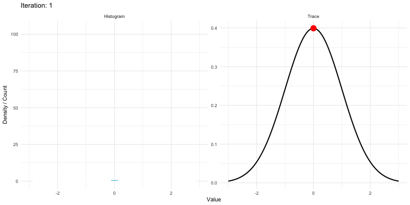
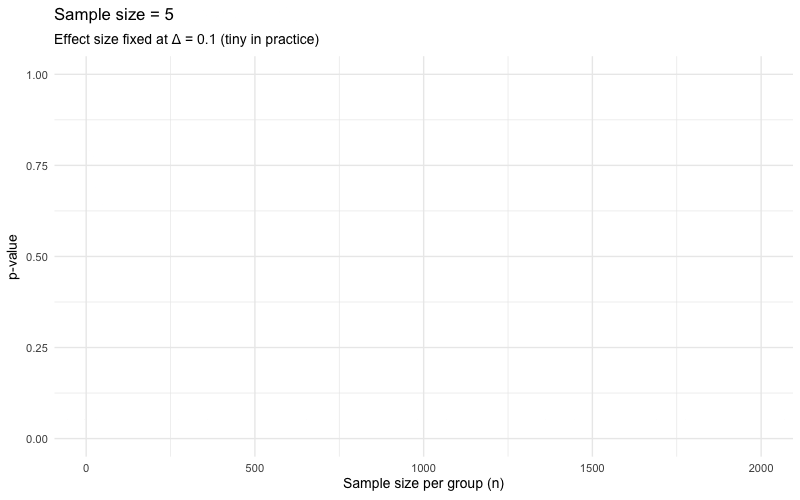
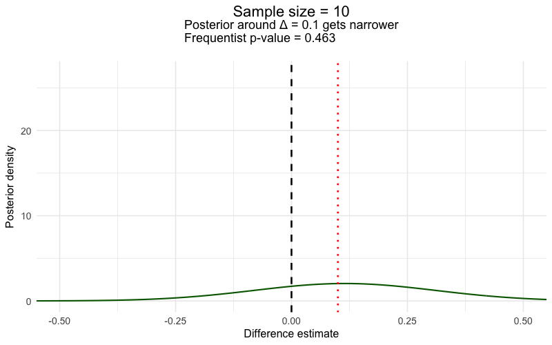

```{r}
#| label: setup
#| include: false
library(tidyverse)
library(BayesFactor)
source(here::here("R/setup.R"))
theme_set(theme_minimal(base_size = 18))
set.seed(705)
crimes <- read_csv(here::here("data/chicago-crimes-2025.csv"), show_col_types = FALSE)

vp <- crimes |> filter(crime_category %in% c("Violent", "Property"))
violent_hours  <- vp$hour[vp$crime_category == "Violent"]
property_hours <- vp$hour[vp$crime_category == "Property"]
```

## This Week

**Topic:** hypothesis testing — *twice*. One question, both great traditions.

- The Null Hypothesis Significance Test: its logic, and its fine print
- p-values: what they are — and what they are not
- Bayes' theorem: priors, updating, and the probability you actually wanted
- Bayes factors and posteriors with the **BayesFactor** package

**Learning goals:** run `t.test()` *and* `ttestBF()` on the same question; state correctly what each output licenses you to claim.

**R4DS thread:** Ch. 19 (Joins) + Ch. 18 skim → Lab 6 joins our two Chicago files.

## Where We've Been

::: incremental
- **Session 4:** sampling distributions — sample statistics fluctuate in predictable ways
- **Session 5:** confidence intervals — one sample, an honest range. Our violent-vs-property time gap was *detectable but tiny*: somewhere between about 4 and 27 minutes
- **Today:** the formal machinery for "is there a difference?" — and then a second tradition that answers the question you probably *meant* to ask
:::

. . .

If this course has a thesis, today is it: **the two traditions are complements, not rivals** — and you will leave able to use both.

# Act I · Testing, the Frequentist Way {background-color="#73000A"}

## Remember Our Question?

Session 5 asked whether violent crimes happen later in the day than property crimes:

```{r}
#| label: recap-means
vp |> summarize(mean_hour = mean(hour), sd_hour = sd(hour),
                n = n(), .by = crime_category)
```

. . .

Violent incidents average about **15 minutes later**. Session 5 gave us an interval for that gap. Today we get the *test* — a yes/no verdict machine.

## Let's Pretend We Sampled Repeatedly

Bootstrap each group's mean 10,000 times — Session 4's logic, applied to both groups at once:

```{r}
#| label: boot-means
#| output-location: slide
#| fig-height: 5.5
boot <- tibble(
  Violent  = replicate(10000, mean(sample(violent_hours,  replace = TRUE))),
  Property = replicate(10000, mean(sample(property_hours, replace = TRUE)))
)

boot |>
  pivot_longer(everything(), names_to = "group", values_to = "boot_mean") |>
  ggplot(aes(boot_mean, fill = group)) +
  geom_histogram(bins = 60, alpha = 0.6, position = "identity", color = NA) +
  scale_fill_manual(values = unname(crju_colors[c("blue", "garnet")])) +
  labs(title = "10,000 bootstrap means per group",
       x = "Mean hour of day", y = "Count", fill = NULL)
```

## The Difference and Its 95% CI

Subtract, pair by pair, and the *difference* gets its own distribution:

```{r}
#| label: boot-diff
boot_diff <- boot$Violent - boot$Property

quantile(boot_diff, c(0.025, 0.975))
```

. . .

The middle 95% of plausible differences runs from about **0.06 to 0.44 hours** — the interval sits *entirely above zero*.

## The Difference, Seen

```{r}
#| label: boot-diff-plot
#| echo: false
#| fig-height: 5.5
ci_boot <- quantile(boot_diff, c(0.025, 0.975))
ggplot(tibble(boot_diff), aes(boot_diff)) +
  geom_histogram(bins = 60, fill = crju_colors["navy"], color = "white") +
  geom_vline(xintercept = 0, color = crju_colors["garnet"], linewidth = 1.2) +
  geom_vline(xintercept = ci_boot, color = crju_colors["gold"],
             linetype = 2, linewidth = 1) +
  labs(title = "Bootstrap distribution of the difference (Violent − Property)",
       subtitle = "Garnet line = zero (no difference); gold dashes = 95% interval",
       x = "Difference in mean hour", y = "Count")
```

Zero is not among the plausible values. The data lean toward a real (if small) gap.

## What If the Interval Crossed Zero?

Erase the real gap on purpose — shift every violent incident earlier by the observed difference — and re-run the exact same machinery:

```{r}
#| label: boot-null
#| echo: false
#| fig-height: 5
violent_shifted <- violent_hours - (mean(violent_hours) - mean(property_hours))
boot_diff_null <- replicate(10000,
  mean(sample(violent_shifted, replace = TRUE)) -
  mean(sample(property_hours,  replace = TRUE)))
ci_null <- quantile(boot_diff_null, c(0.025, 0.975))

ggplot(tibble(boot_diff_null), aes(boot_diff_null)) +
  geom_histogram(bins = 60, fill = crju_colors["gray"], color = "white") +
  geom_vline(xintercept = 0, color = crju_colors["garnet"], linewidth = 1.2) +
  geom_vline(xintercept = ci_null, color = crju_colors["gold"],
             linetype = 2, linewidth = 1) +
  labs(title = "Same machinery, after erasing the gap",
       subtitle = paste0("95% interval: ", round(ci_null[1], 2), " to ",
                         round(ci_null[2], 2), " — zero is now a plausible value"),
       x = "Difference in mean hour", y = "Count")
```

When zero sits comfortably inside, the data are *consistent with no difference*. Formalize this intuition and you have invented the NHST.

## The Null Hypothesis Significance Test {.smaller}

::: incremental
1. **State the null**, $H_0$: no difference ($\mu_V - \mu_P = 0$). The boring world.
2. **State the alternative**, $H_1$: *some* difference. Note how little we commit to.
3. **Compute a test statistic**: $t = \text{observed difference} \,/\, SE$ — the gap, in SE units.
4. **Ask:** how often would $|t|$ this large appear by luck in the boring world? The **p-value**.
5. **Verdict:** $p < \alpha$ (usually .05) → "reject $H_0$." Otherwise → "fail to reject."
6. Note: the machine only weighs evidence **against the null** — $H_1$ never gets scored.
:::

## Watch the p-Value Do Its Job

<video src="../media/week-06/NHST.mp4" controls preload="metadata" style="max-height:430px;"></video>

As the true difference grows, the overlap shrinks and *p* falls. Black = null · green = one alternative · orange = overlap · blue dashes = the α = .05 cutoffs.

## What a p-Value Is — and Is Not

**It is:** the probability of data *this extreme or more*, **if** the null is true and the model is right.

. . .

**It is not:**

::: incremental
- ~~the probability the null hypothesis is true~~ — that's $P(H_0 \mid \text{data})$, which frequentism never computes
- ~~the probability the result "is due to chance"~~ — same confusion, folksier outfit
- ~~1 − the probability the alternative is true~~
- ~~a measure of how *big* or *important* the effect is~~ — with enough data, microscopic effects earn microscopic p-values (hold that thought)
:::

## `t.test()` on the Real Question

```{r}
#| label: ttest-real
t.test(hour ~ crime_category, data = vp)
```

```{r}
#| label: ttest-store
#| include: false
tt <- t.test(hour ~ crime_category, data = vp)
```

## Reading the Verdict

- R orders groups alphabetically, so this tests **Property − Violent** (hence the negative signs — same finding as our bootstrap, mirrored)
- $t = `r round(tt$statistic, 2)`$, and $p = `r round(tt$p.value, 3)`$

. . .

$p < .05$ — **"statistically significant."** Reject the null. Publish the press release?

. . .

Hold that thought until Act III. First, some fine print about what this machine quietly assumed.

# The Fine Print: Some Strong Assumptions {background-color="#1B2A4A"}

## Assumption 1 · The Null Stands Alone

```{r}
#| label: sketch-null
#| echo: false
#| fig-height: 5
t_obs <- 1.8
x_grid <- seq(-6, 6, length.out = 500)
null_df <- tibble(x = x_grid, y = dt(x_grid, df = 28))

sketch_base <- ggplot() +
  geom_line(data = null_df, aes(x, y), color = "black", linewidth = 1.3) +
  geom_vline(xintercept = t_obs, color = crju_colors["garnet"],
             linetype = 2, linewidth = 1.1) +
  labs(x = "t statistic", y = "Density") +
  theme(legend.position = "bottom")

sketch_base +
  labs(title = "Everything is scored against one curve: the null",
       subtitle = "Black = null distribution · garnet dash = an observed t (sketched at 1.8)")
```

We computed how surprising the data are *under the null* — and never once said what the alternative world looks like.

## …But the Alternative Could Be Anywhere

```{r}
#| label: sketch-alts
#| echo: false
#| fig-height: 5
alts <- bind_rows(
  tibble(x = x_grid, y = dnorm(x_grid, t_obs,     1), alt = "Centered at the estimate"),
  tibble(x = x_grid, y = dnorm(x_grid, t_obs + 2, 1), alt = "Further right"),
  tibble(x = x_grid, y = dnorm(x_grid, t_obs - 2, 1), alt = "Further left")
)

sketch_base +
  geom_line(data = alts, aes(x, y, color = alt), linewidth = 1.1, alpha = 0.7) +
  scale_color_manual(values = unname(crju_colors[c("blue", "gold", "green")]),
                     name = NULL) +
  labs(title = "Three (of infinitely many) alternatives consistent with that t",
       subtitle = "NHST never asks which of these predicted the data better")
```

"Reject the null" tells you where you *aren't*. It never tells you where you *are*.

## Assumption 2 · The Shape Itself

```{r}
#| label: sketch-dist-null
#| echo: false
#| fig-height: 5
sketch_base +
  labs(title = "The null curve is itself an assumption",
       subtitle = "That tidy t-distribution presumes the model behind it is right")
```

The p-value came from *this specific curve* — which assumes (roughly) normal-enough data, independent observations, well-behaved variances.

## …And Many Shapes Fit the Same Data

```{r}
#| label: sketch-dist-many
#| echo: false
#| fig-height: 5
shapes <- bind_rows(
  tibble(x = x_grid, y = dt(x_grid - 2, df = 28),       shape = "Shifted t"),
  tibble(x = x_grid, y = dt(x_grid / 1.5, df = 3) / 1.5, shape = "Fat-tailed (t, df = 3)"),
  tibble(x = x_grid, y = dlnorm(x_grid, meanlog = 0.4, sdlog = 0.55), shape = "Right-skewed (lognormal)"),
  tibble(x = x_grid, y = dgamma(pmax(x_grid, 0), shape = 2, rate = 1), shape = "Gamma(2, 1)")
)

sketch_base +
  geom_line(data = shapes, aes(x, y, color = shape), linewidth = 1, alpha = 0.75) +
  scale_color_manual(values = unname(crju_colors[c("blue", "gold", "green", "rust")]),
                     name = NULL) +
  labs(title = "Possible realities the test never checked",
       subtitle = "We rarely verify which of these worlds generated the data")
```

How often do researchers *test* those assumptions before trusting the p-value? Less often than you'd hope.

# Act II · Thinking Like a Bayesian {background-color="#73000A"}

## Enter Bayes' Theorem

$$
\underbrace{P(H \mid \text{data})}_{\textbf{posterior}} \;=\;
\frac{\overbrace{P(\text{data} \mid H)}^{\textbf{likelihood}} \;\times\; \overbrace{P(H)}^{\textbf{prior}}}
{\underbrace{P(\text{data})}_{\textbf{evidence}}}
$$

::: incremental
- The p-value lives entirely in the **likelihood** world: $P(\text{data} \mid H_0)$
- Bayes flips the conditional: $P(H \mid \text{data})$ — the question your chief, your judge, your city council actually asked
- The price of admission: a stated **prior** — what you believed before the data
:::

## Bayesian Updating, Watched Live

Start moderately confident a coin is fair — prior Beta(20, 20) — then flip it 100 times and update after every flip:


Each flip reshapes the curve. Beliefs are provisional, quantified, and revised by evidence — that is the entire philosophy in one gif.

## The Dreaded *Adamsitis* Strain of *Ianfluenza*

A screening problem (any resemblance to a frequent co-author is coincidental):

- Prevalence **1%** — 10 cases per 1,000 people
- Sensitivity **.90** — catches 90% of true cases
- Specificity **.95** — clears 95% of the healthy

## Two Questions That *Sound* Identical — and Are Not

1. $P(\text{test says} + \mid \text{actually sick})$ — what the brochure advertises
2. $P(\text{actually sick} \mid \text{test says} +)$ — what you want in the exam room

## Count It Out: 1,000 People

|  | Test says **+** | Test says **−** | Total |
|---|---:|---:|---:|
| **Sick** (1%) | **9** caught | 1 missed | 10 |
| **Healthy** | **~50** false alarms | ~941 cleared | 990 |
| **Total** | ~59 | ~942 | 1,000 |

. . .

$$
P(\text{sick} \mid +) \;=\; \frac{9}{9 + 50} \;\approx\; 15\%
$$

The test is "90% accurate" — and a positive result still means you are *probably fine*.

## Priors Matter

::: incremental
- Read the test result the intuitive way — "the test is 90% accurate, so I'm 90% sick" — and you have silently treated $P(\text{data} \mid H)$ as $P(H \mid \text{data})$
- The **base rate** (the prior: 1%) is what separates 90% from 15%. Ignoring it makes the test look far more powerful than it really is
- Criminal justice runs on rare events: false confessions, officer-involved shootings, risk-assessment flags, gunshot-residue matches. Base-rate neglect is not a party trick here — it convicts people
:::

## The Two Traditions, Side by Side {.smaller}

| | Frequentist | Bayesian |
|---|-------------|----------|
| **Asks** | How surprising are these data if $H_0$ is true? | How probable is each hypothesis, given the data? |
| **Probability attaches to** | Data, over imagined repeated samples | Hypotheses and parameters directly |
| **Prior knowledge** | None used | Explicit, stated up front |
| **Output** | p-value, confidence interval | Posterior distribution, Bayes factor, credible interval |
| **"95%" means** | The *procedure* captures the truth in 95% of replications | 95% probability the parameter lies in *this* interval |

# So Why Not Always Bayes? {background-color="#1B2A4A"}

## The Ugly Denominator

$$
P(H \mid \text{data}) = \frac{P(\text{data} \mid H)\,P(H)}{\color{#73000A}{P(\text{data})}}
$$

That innocent-looking denominator is the probability of the data under *every possible hypothesis, weighted by its prior*:

$$
\color{#73000A}{P(\text{data}) = \int P(\text{data} \mid \theta)\, P(\theta)\, d\theta}
$$

. . .

For realistic models this integral is **intractable** — for most of the 20th century, Bayes was philosophically beautiful and practically unusable.

## Enter MCMC

How Markov chain Monte Carlo "measures the curve" without solving the integral:

::: incremental
- We don't know the whole posterior curve — but we *do* know its **formula up to a constant** (likelihood × prior)
- A sampler evaluates that formula at its **current spot** and at a **proposed spot**
- Compare the two values: if the new spot is higher → **accept**; if lower → accept *with that probability*
- The impossible constant appears in both numerator and denominator — it **cancels in the ratio**. We never need to know it
:::

## MCMC, Watched Live

A Metropolis sampler exploring a distribution (left) while its samples pile up into that very shape (right):



## We End Up With the Probability Distribution

::: incremental
- The pile of accepted samples **is** the posterior — to any precision you like, just run longer
- Think back to Session 4: we approximated *sampling* distributions by drawing samples and stacking them. MCMC plays exactly the same trick on the *posterior*
- This is why modern Bayes is possible at all — and it is what `BayesFactor` quietly does for you in about two seconds
:::

# Act III · Both Traditions, One Real Question {background-color="#73000A"}

## The Bayesian t-Test: `ttestBF()`

Same question, second tradition. We supply the groups ourselves, so the direction is ours: **x − y = Violent − Property**.

```{r}
#| label: bf-run
# install.packages("BayesFactor")   # once, if you don't have it
bf <- ttestBF(x = violent_hours, y = property_hours)
bf
```

## Reading a Bayes Factor

```{r}
#| label: bf-extract
extractBF(bf)$bf        # BF10: evidence for a difference vs. no difference
1 / extractBF(bf)$bf    # BF01: the same evidence, read the other way
```

::: incremental
- A Bayes factor is a **ratio of predictions**: how well did "some difference" predict these data vs. "no difference"?
- $BF_{10} = `r round(extractBF(bf)$bf, 2)`$ — *below* 1. The data are about **`r round(1 / extractBF(bf)$bf, 1)` times more consistent with the null**
- Rules of thumb: 1–3 barely worth mentioning · 3–10 moderate · 10+ strong (and the mirror image below 1)
:::

## Hold On — the p-Value Said "Significant"

| | Frequentist | Bayesian |
|---|---|---|
| Result | $p = `r round(tt$p.value, 3)`$ → reject $H_0$ | $BF_{10} = `r round(extractBF(bf)$bf, 2)`$ → mild evidence *for* $H_0$ |

::: incremental
- With ~19,500 cases, the test can detect *microscopic* gaps — and 15 minutes is microscopic
- The BF asks a harder question: did "a difference of plausible size" predict the data better than "zero"? This close to zero, **the null predicted slightly better**
- Neither is wrong. They answer **different questions** — and only one is impressed by sheer sample size
:::

## The Posterior for the Difference

The Bayes factor compares models. The **posterior** describes the difference itself — via MCMC, exactly as advertised:

```{r}
#| label: bf-posterior
post <- suppressMessages(posterior(bf, iterations = 10000))
diff_post <- as.numeric(post[, "beta (x - y)"])

quantile(diff_post, c(0.025, 0.975))
mean(diff_post > 0)
```

```{r}
#| label: post-stats
#| include: false
cred <- quantile(diff_post, c(0.025, 0.975))
p_gt0 <- mean(diff_post > 0)
```

## The Posterior, Seen

```{r}
#| label: posterior-plot
#| echo: false
#| fig-height: 5
ggplot(tibble(diff_post), aes(diff_post)) +
  geom_histogram(bins = 60, fill = crju_colors["green"], color = "white") +
  geom_vline(xintercept = 0, color = crju_colors["garnet"], linewidth = 1.2) +
  geom_vline(xintercept = cred, color = crju_colors["gold"],
             linetype = 2, linewidth = 1) +
  labs(title = "Posterior distribution of the difference (Violent − Property, hours)",
       subtitle = paste0("95% credible interval: ", round(cred[1], 2), " to ",
                         round(cred[2], 2), " hours · P(difference > 0) = ",
                         round(p_gt0, 3)),
       x = "Difference in mean hour", y = "Posterior samples")
```

. . .

Now say the sentence Session 5 forbade — **legally**: *"There is a 95% probability the true difference lies between about `r round(cred[1] * 60)` and `r round(cred[2] * 60)` minutes."* Under the Bayesian license (given the model and prior), that is exactly what this interval means.

## Detectable, Probable — and Tiny

One more number every report owes its reader — a standardized **effect size** (Cohen's *d*):

```{r}
#| label: cohens-d
sd_pooled <- sqrt((var(violent_hours) + var(property_hours)) / 2)
(mean(violent_hours) - mean(property_hours)) / sd_pooled
```

::: incremental
- Benchmarks: 0.2 "small" · 0.5 "medium" · 0.8 "large." We measured **~0.04**
- A ~15-minute shift against SDs of nearly 7 *hours*. Would any commander re-draw a patrol schedule over this?
- The full picture: the difference is *probably real* (posterior), *utterly trivial* (d), and "significant" (p) only because n is enormous. **Report all three; never let the star do the talking**
:::

# Act IV · A Cleaner Collision: The Recidivism Trial {background-color="#1B2A4A"}

## The Setup

- **Context:** typical recidivism runs about **60%** — that's our prior belief
- **Design:** randomized trial of a reentry program — **100 treated, 100 control**
- **Outcomes:** control **50/100** reoffend · treatment **40/100** reoffend
- **Question:** did the program reduce recidivism?

. . .

Ten percentage points, exactly the kind of effect a city would fund. Both traditions, go.

## The Frequentist Answer

```{r}
#| label: recid-freq
prop.test(x = c(40, 50), n = c(100, 100))
```

## The Frequentist Answer, Read Aloud

```{r}
#| label: recid-freq-p
prop.test(x = c(40, 50), n = c(100, 100))$p.value
```

::: incremental
- $p = 0.20$ — **not statistically significant**
- Honest reading: *a 10-point gap like this could plausibly occur even if the program did nothing*
- The grant report writes itself — "no significant effect" — and the program probably dies there
:::

## The Bayesian Answer

Prior: Beta(6, 4) — mean 0.6, worth about 10 observations. Update each group, then ask the question we care about directly:

```{r}
#| label: recid-bayes
set.seed(705)
theta_treat   <- rbeta(10000, 6 + 40, 4 + 60)   # posterior, treatment
theta_control <- rbeta(10000, 6 + 50, 4 + 50)   # posterior, control

mean(theta_treat < theta_control)   # P(program reduces recidivism)
```

. . .

Given the prior and the data, there is about a **91% probability the program reduces recidivism**.

## The Posteriors, Seen

```{r}
#| label: recid-plot
#| echo: false
#| fig-height: 5.5
tibble(theta = c(theta_treat, theta_control),
       group = rep(c("Treatment", "Control"), each = 10000)) |>
  ggplot(aes(theta, fill = group)) +
  geom_density(alpha = 0.5, color = NA) +
  scale_fill_manual(values = unname(crju_colors[c("gray", "garnet")])) +
  labs(title = "Posterior beliefs about each group's recidivism rate",
       subtitle = "Overlap is real — and still, treatment sits lower in 91% of draws",
       x = "Recidivism probability (θ)", y = "Posterior density", fill = NULL)
```

## Same Data, Different Questions

| | Frequentist | Bayesian |
|---|---|---|
| Verdict | $p = 0.20$: cannot reject "no effect" | $P(\text{treatment} < \text{control}) \approx 0.91$ |
| Plain English | "This gap could plausibly be luck" | "9-to-1 odds the program works" |

::: incremental
- Both statements are **true of the same data**. Neither is a trick
- A policymaker deciding whether to fund the program next year: which sentence actually helps?
- Your homework asks you to sit with exactly this discomfort
:::

# Act V · Sample Size Changes Everything {background-color="#73000A"}

## The p-Value and Sample Size

Fix a *trivial* true effect (Δ = 0.1) and just keep collecting data:



The effect never grows — only *n* does — and *p* still dives below .05. **Given enough data, everything is "significant."**

## Bayes and Sample Size

Same trivial effect, Bayesian glasses — watch the posterior for the difference as *n* grows:



More data doesn't flip a verdict — it **sharpens the estimate**, which visibly converges on "about 0.1, i.e., almost nothing." The tininess stays in view. (This is Act III's collision, run in slow motion.)

## What We Learned Today

::: incremental
- **NHST**: standardized and everywhere — but it only asks *how surprising are the data under the null?*, never scores the alternative, and rewards sheer n
- **p-values** are not the probability any hypothesis is true, and are silent about *size*
- **Bayes** answers $P(H \mid \text{data})$ at the price of a stated prior; MCMC made it computable
- The same data can yield $p < .05$ *and* a BF favoring the null — or $p = 0.20$ *and* 91% posterior confidence
- Whatever tradition you use: **report the effect size, in units a human cares about**
:::

## Today's Lab & Homework

- **Lab 6:** joining data — `left_join()` on the two Chicago files, and the join traps R4DS warned you about ([lab page](../labs/lab-06-joins.qmd))
- **Homework 6:** Bayesian vs. frequentist reasoning, plus both t-tests on a new Chicago question (posted on the [Session 6 page](../weeks/week-06.qmd))
- **Next session — the applied data workshop:** the full messy-data pipeline, start to finish. **Your final-project dataset selection is due at Session 7** — come with a candidate dataset and be ready to defend it
