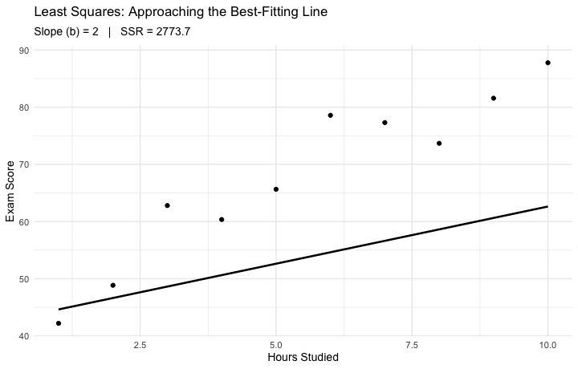

```{r}
#| label: setup
#| include: false
library(tidyverse)
library(bayesplot)
library(brms)
library(car)
library(plotly)
source(here::here("R/setup.R"))
theme_set(theme_minimal(base_size = 18))
set.seed(705)
areas <- read_csv(here::here("data/chicago-areas.csv"), show_col_types = FALSE)
```

## This Week

- **Least squares**, the line of best fit, and **R²**
- Two predictors: the best-fitting **plane** — you'll spin it with your mouse
- *"Holding the others constant"* — reading coefficients honestly
- Diagnostics: the residual plot and **VIF**
- The **Bayesian version** with `brms`; reporting both traditions

**Learning goals:** fit, interpret, and diagnose `lm()` with several predictors — and say what a coefficient does *and doesn't* mean.

**Project:** Homework 11 contains **Checkpoint 3** — your first regression on *your* data.

## Where We've Been

::: incremental
- **Session 10:** correlation — *r* measured how tightly two variables move together; *r²* was the variance they share; the Bayesian version gave us a posterior instead of a single number
- Two humility rules came with it: **correlation is not causation**, and **area-level patterns are not people-level claims** (the ecological fallacy)
- **Today:** correlation says *that* two variables travel together. Regression answers the sharper question: **how much** — and with several predictors, how much does each matter *after accounting for the others*?
:::

## The New Question

Correlation is a **one-lane road** between two variables.

Multiple regression adds more lanes — but all the traffic still arrives at one place: the outcome, $Y$. Each predictor lane contributes part of how we got there.

. . .

The question multiple regression answers:

> **"How much does Y change when $X_1$ changes by one unit, *holding $X_2$ constant*?"**

. . .

That phrase — *holding constant* — is the entire value added today. We'll earn it slowly.

# One Predictor, One Line {background-color="#73000A"}

## The Model, With One Predictor

$$Y = a + bX + e$$

| Piece | Name | Meaning |
|-------|------|---------|
| $Y$ | outcome | the thing we're predicting (DV) |
| $a$ | intercept | predicted $Y$ when $X = 0$ |
| $b$ | slope | change in predicted $Y$ per one-unit change in $X$ |
| $e$ | error | what the line leaves unexplained |

The model is a claim: *knowing X, here's my best guess at Y — plus some miss.*

The **residual** is each observation's miss: actual $Y$ minus predicted $Y$.

## Ten Students, Hours and Scores

```{r}
#| label: ls-data
#| output-location: column
#| fig-height: 5.5
#| fig-width: 6
# seed 1 kept from the 2025 deck — the three
# candidate lines coming up were tuned to this draw
set.seed(1)
students <- tibble(
  hours = 1:10,
  score = 40 + 5 * hours + rnorm(10, 0, 5)
)

ggplot(students, aes(hours, score)) +
  geom_point(size = 4, color = crju_colors["navy"]) +
  labs(x = "Hours studied", y = "Exam score")
```

Some line through this cloud is the "best" one. **Best by what ruler?**

## Three Candidate Lines

```{r}
#| label: ls-candidates
#| echo: false
#| fig-height: 5.5
candidates <- tibble(
  a = c(20, 50, 37),
  b = c(5, 3, 5.2),
  line = c("a = 20, b = 5", "a = 50, b = 3", "a = 37, b = 5.2")
)

ggplot(students, aes(hours, score)) +
  geom_abline(data = candidates, aes(intercept = a, slope = b, color = line),
              linewidth = 1.1) +
  geom_point(size = 4, color = crju_colors["navy"]) +
  scale_color_manual(values = unname(crju_colors[c("rust", "green", "blue")])) +
  labs(x = "Hours studied", y = "Exam score", color = NULL,
       title = "Which line is best? We need a ruler, not a vibe.")
```

## The Ruler: Sum of Squared Residuals

For any candidate line, measure every vertical miss, square it (so misses above and below don't cancel), and add them up:

```{r}
#| label: ls-ssr
SSR <- function(a, b) {
  predicted <- a + b * students$hours
  sum((students$score - predicted)^2)
}

SSR(20, 5)      # too low
SSR(50, 3)      # too flat
SSR(37, 5.2)    # roughly right
```

. . .

Smaller total = better line. **Least squares** = find the line with the smallest total of all.

## `lm()` Finds the Winner

No trial and error — `lm()` solves for the one line that minimizes SSR:

```{r}
#| label: ls-lm
fit_hours <- lm(score ~ hours, data = students)
coef(fit_hours)

SSR(coef(fit_hours)[1], coef(fit_hours)[2])
```

. . .

Our best hand-picked guess left `r round(SSR(37, 5.2), 0)` in squared misses; `lm()` gets it down to `r round(SSR(coef(fit_hours)[1], coef(fit_hours)[2]), 0)` — and **no other line does better**.

Read the slope: each additional hour of studying predicts about **`r round(coef(fit_hours)[2], 1)` more points**, in this sample.

## Watching the Search Land



The line tilts until the SSR stops shrinking — then it's *the* least-squares line.

## What the Line Leaves Behind

```{r}
#| label: ls-residuals
#| echo: false
#| fig-height: 5.5
students_fit <- students |>
  mutate(predicted = fitted(fit_hours))

ggplot(students_fit, aes(hours, score)) +
  geom_segment(aes(xend = hours, yend = predicted),
               color = crju_colors["garnet"], linewidth = 1) +
  geom_abline(intercept = coef(fit_hours)[1], slope = coef(fit_hours)[2],
              linewidth = 1) +
  geom_point(size = 4, color = crju_colors["navy"]) +
  labs(x = "Hours studied", y = "Exam score",
       title = "Residuals: the vertical distances the line couldn't explain",
       subtitle = "Least squares makes the sum of these, squared, as small as possible")
```

## R²: How Much Did We Explain?

```{r}
#| label: ls-r2
summary(fit_hours)$r.squared
cor(students$hours, students$score)^2
```

::: incremental
- **R² = the proportion of the outcome's variance the model accounts for.** Here, hours studied explain ~95% of the spread in scores (it's simulated data — real life will humble us shortly).
- Notice the second line: with one predictor, **R² is just Session 10's correlation, squared**. Same quantity, new outfit.
- With *multiple* predictors, R² keeps the same meaning — variance explained by the whole team — but no single correlation owns it anymore.
:::

# More Lanes: Multiple Predictors {background-color="#1B2A4A"}

## The Model, Full Form

$$Y = \beta_0 + \beta_1 X_1 + \beta_2 X_2 + \cdots + \beta_k X_k + e$$

- $\beta_0$ — intercept: predicted $Y$ when **every** $X$ is zero (often a nonsense scenario; it anchors the model, it doesn't need to be meaningful)
- $\beta_1 \ldots \beta_k$ — slopes: the effect of each $X$ ***holding the others constant***
- $e$ — error: what's still unexplained

. . .

Each $\beta$ is conceptually a **partial** relationship — how $X_1$ relates to $Y$ *after removing the overlap* with the other predictors. That's what makes multiple regression more than a stack of correlations.

## From Line to Plane

::: incremental
- One predictor: the model is a **line** through a 2-D cloud
- Two predictors: the model is a **plane** floating in a 3-D cloud — one slope along each predictor's axis
- The ruler never changes: **least squares** — minimize the total squared vertical distance from every point to the surface
- Three or more predictors: a *hyperplane* in a space we can't draw. The math shrugs; only our eyes give out.
:::

. . .

Two predictors is the last stop where we can actually **see** the model. So let's look at it properly.

## The Best-Fitting Plane, Live

```{r}
#| label: plane-3d
#| echo: false
# seed 42 kept from the 2025 deck — this keeps the simulated cloud (and the
# fitted plane) identical to the recorded walkthrough on the next slide
set.seed(42)
x1 <- runif(100, 0, 10)
x2 <- runif(100, 0, 10)
y  <- 10 + 2 * x1 + 3 * x2 + rnorm(100, 0, 2)
plane_data <- data.frame(x1, x2, y)

plane_fit <- lm(y ~ x1 + x2, data = plane_data)

plane_grid <- expand.grid(
  x1 = seq(min(x1), max(x1), length.out = 20),
  x2 = seq(min(x2), max(x2), length.out = 20)
)
plane_grid$y_hat <- predict(plane_fit, newdata = plane_grid)

plot_ly(plane_data, x = ~x1, y = ~x2, z = ~y,
        type = "scatter3d", mode = "markers",
        marker = list(size = 4, color = "blue"),
        width = 950, height = 520) |>
  add_surface(x = matrix(plane_grid$x1, 20, 20),
              y = matrix(plane_grid$x2, 20, 20),
              z = matrix(plane_grid$y_hat, 20, 20),
              showscale = FALSE, opacity = 0.6) |>
  layout(
    scene = list(
      xaxis = list(title = "X1"),
      yaxis = list(title = "X2"),
      zaxis = list(title = "Y (Outcome)")
    ),
    title = "Multiple Regression: Best-Fitting Plane in 3D"
  )
```

Grab it and spin it.

## The Guided Tour

Points above the plane are positive residuals; below, negative. For the walkthrough again later — same plane, narrated:

<video src="../media/week-11/regression-plane.mp4" controls preload="metadata"></video>

# The Lurking Third Variable {background-color="#73000A"}

## Remember the Lurker?

Ice cream sales and drowning deaths are strongly correlated. Every summer. Reliably.

```{r}
#| label: lurk-data
#| output-location: slide
#| fig-height: 5.5
set.seed(705)
lurk <- tibble(
  temperature    = runif(100, 60, 100),
  icecream_sales = 20 + 5 * temperature + rnorm(100, 0, 30),
  drownings      = -10 + 0.8 * temperature + rnorm(100, 0, 10)
)

ggplot(lurk, aes(icecream_sales, drownings)) +
  geom_point(color = crju_colors["navy"], size = 2.5) +
  geom_smooth(method = "lm", se = FALSE, color = crju_colors["garnet"]) +
  labs(title = paste0("r = ", round(cor(lurk$icecream_sales, lurk$drownings), 2),
                      " — ban ice cream?"),
       x = "Ice cream sales", y = "Drownings")
```

## Model 1: Ice Cream "Predicts" Drownings

```{r}
#| label: lurk-m1
lurk_m1 <- lm(drownings ~ icecream_sales, data = lurk)
summary(lurk_m1)$coefficients |> round(4)
```

::: incremental
- The coefficient is positive and the p-value has ten zeros in it
- It's statistically significant. The model says it's real.
- **Do we believe it?** No — but notice that *nothing in this output warns us*. The model can only see the variables we gave it.
:::

## Model 2: Give the Model the Lurker

```{r}
#| label: lurk-m2
lurk_m2 <- lm(drownings ~ icecream_sales + temperature, data = lurk)
summary(lurk_m2)$coefficients |> round(4)
```

. . .

Holding temperature constant, ice cream's coefficient collapses to ~0 (and goes nonsignificant). Temperature was driving **both** variables the whole time.

This is *holding constant* doing real work: comparing days with the **same temperature**, ice cream tells you nothing about drownings.

## Side by Side

```{r}
#| label: lurk-compare
#| echo: false
tibble(
  model = c("drownings ~ icecream", "drownings ~ icecream + temperature"),
  `icecream coef` = c(round(coef(lurk_m1)[2], 3), round(coef(lurk_m2)[2], 3)),
  `icecream p` = c(format.pval(summary(lurk_m1)$coefficients[2, 4], digits = 2),
                   round(summary(lurk_m2)$coefficients[2, 4], 2)),
  `temperature coef` = c("—", as.character(round(coef(lurk_m2)[3], 2))),
  `R²` = c(round(summary(lurk_m1)$r.squared, 2), round(summary(lurk_m2)$r.squared, 2))
) |>
  knitr::kable()
```

::: incremental
- A "significant" bivariate relationship **evaporated** once the right third variable entered
- Beware the evil lurking third variable. It does not announce itself.
:::

## Seeing "Holding Constant"

An **added-variable plot** shows the ice cream–drownings relationship *after* temperature's contribution is removed from both:

```{r}
#| label: lurk-avplot
#| echo: false
#| fig-height: 5
avPlots(lurk_m2, terms = ~ icecream_sales,
        main = "Ice cream vs. drownings, with temperature partialed out")
```

Flat. That flat line *is* the multiple-regression coefficient for ice cream.

## The Moral

::: incremental
- Multiple regression can hold constant **only the variables you measured and included**
- Every observational model has *potential* lurkers you didn't measure — so coefficients are **adjusted associations, not causal effects**
- "Holding constant" is a statistical operation, not a controlled experiment
- This is why theory matters: *which* variables belong in the model is a substantive question, not a statistical one
:::

. . .

Keep this loaded. We're about to fit real Chicago models, and the temptation to talk causally will be enormous.

# Real Data: Violence Across Chicago's 77 Areas {background-color="#1B2A4A"}

## Look First. Always.

```{r}
#| label: chi-scatter
#| echo: false
#| fig-height: 5.5
ggplot(areas, aes(unemployment_rate, violent_rate)) +
  geom_point(color = crju_colors["garnet"], size = 2.5, alpha = 0.8) +
  geom_smooth(method = "lm", se = FALSE, color = crju_colors["navy"]) +
  labs(title = "Violent-crime rate vs. unemployment, 77 community areas (2025)",
       subtitle = "Each dot is a community area — not a person. Say it with me: ecological.",
       x = "Unemployment rate (%)", y = "Violent crimes per 1,000 residents")
```

## One Predictor First

```{r}
#| label: chi-m1
#| output-location: slide
chi_m1 <- lm(violent_rate ~ unemployment_rate, data = areas)
summary(chi_m1)
```

. . .

Each additional percentage point of unemployment is associated with **`r round(coef(chi_m1)[2], 1)` more violent crimes per 1,000 residents**, and unemployment alone accounts for **`r round(summary(chi_m1)$r.squared * 100, 0)`%** of the between-area variance. Strong — but is unemployment getting credit for other disadvantage it travels with?

## Add a Second Predictor: Vacant Housing

```{r}
#| label: chi-m2
#| output-location: slide
chi_m2 <- lm(violent_rate ~ unemployment_rate + pct_vacant, data = areas)
summary(chi_m2)
```

. . .

Both predictors earn significant coefficients, and R² climbs from `r round(summary(chi_m1)$r.squared, 2)` to **`r round(summary(chi_m2)$r.squared, 2)`**.

Watch unemployment's slope: **`r round(coef(chi_m1)[2], 1)` → `r round(coef(chi_m2)[2], 1)`**. Some of what looked like "unemployment" in the simple model was shared with vacancy. That shrinkage *is* "holding constant" — the lurker lesson, on real data.

## Reading the Coefficients Out Loud

- **Intercept (`r round(coef(chi_m2)[1], 1)`):** predicted rate when both predictors are 0 — no Chicago area looks like that; it anchors the plane, nothing more

- **`unemployment_rate` (`r round(coef(chi_m2)[2], 2)`):** +1 point of unemployment ↔ ~`r round(coef(chi_m2)[2], 1)` more violent crimes per 1,000 residents, **vacancy held fixed**

- **`pct_vacant` (`r round(coef(chi_m2)[3], 2)`):** +1 point of vacancy ↔ ~`r round(coef(chi_m2)[3], 1)` more violent crimes per 1,000 residents, **unemployment held fixed**

## What These Coefficients Are *Not*

::: incremental
- **Not causal effects.** Adjusted associations between *areas* — and every lurker we didn't measure is still at large
- **Not people-level claims.** An unemployed *person* is not "`r round(coef(chi_m2)[2], 1)` crimes more dangerous." Area-level in, area-level out — Session 10's ecological fallacy rides along with every coefficient today
- **Not the full story.** The model holds constant *only what's in the model*
:::

## Watch the Units

Coefficient *size* is meaningless until you check the predictor's units. Median income, in **dollars**:

```{r}
#| label: chi-units
coef(lm(violent_rate ~ median_income, data = areas))

areas |>
  mutate(income_10k = median_income / 10000) |>
  lm(violent_rate ~ income_10k, data = _) |>
  coef()
```

. . .

Same model, same fit. But −0.0006 "looks like" nothing; the honest reading is **~6 *fewer* violent crimes per 1,000 residents per $10,000 of median income**. Rescale before you interpret.

## Does a Third Predictor Earn Its Keep?

Add the share of adults without a high-school diploma:

```{r}
#| label: chi-m3
chi_m3 <- lm(violent_rate ~ unemployment_rate + pct_vacant + pct_no_hs_diploma,
             data = areas)
summary(chi_m3)$coefficients |> round(3)
```

::: incremental
- Coefficient ≈ 0, p ≈ 0.77 — with unemployment and vacancy already in, it adds nothing detectable; **adjusted R²** (R² with a per-predictor penalty) actually *falls*: `r round(summary(chi_m2)$adj.r.squared, 3)` → `r round(summary(chi_m3)$adj.r.squared, 3)`
- More predictors ≠ more truth. Every variable argues its way in — theory first, fit second
:::

# Checking the Model: Diagnostics {background-color="#73000A"}

## The Residual Plot

Regression assumes the misses are patternless. So **look at the misses**:

```{r}
#| label: chi-resid
#| output-location: slide
#| fig-height: 5.5
chi_diag <- tibble(fitted = fitted(chi_m2), residual = resid(chi_m2))

ggplot(chi_diag, aes(fitted, residual)) +
  geom_hline(yintercept = 0, linetype = 2) +
  geom_point(color = crju_colors["navy"], size = 2.5, alpha = 0.8) +
  labs(title = "Residuals vs. fitted values — the all-purpose diagnostic",
       x = "Fitted violent-crime rate", y = "Residual")
```

## Reading Our Residual Plot Honestly

::: incremental
- **What we want:** a patternless horizontal band around zero
- **What we have:** centered on zero with no obvious curve (good — the straight-plane assumption isn't visibly wrong), but the **spread widens** at higher fitted values — the model misses by more in high-violence areas
- That fanning (*heteroscedasticity*) is common with rate outcomes. It doesn't bias the coefficients, but it makes the SEs less trustworthy at the extremes — worth a sentence when you report
- A **curve** in this plot would be worse news: it would say the model's *shape* is wrong, not just its noise
:::

## Multicollinearity: When Predictors Tell the Same Story

If two predictors move in near-lockstep, the model can't tell **whose** coefficient the shared variance belongs to — estimates get wobbly and standard errors balloon.

. . .

**VIF** (variance inflation factor, from the `car` package) measures how redundant each predictor is with all the others.

Common rules of thumb: **VIF > 5** — pay attention; **VIF > 10** — you have a problem.

## VIF on Our Model

```{r}
#| label: chi-vif
vif(chi_m2)
```

::: incremental
- ~1.8: unemployment and vacancy are correlated (r ≈ 0.67), but each still carries plenty of its own information
- If VIF *were* high: drop one predictor, combine them into an index, or accept wide intervals — you cannot p-value your way out
:::

# The Bayesian Version {background-color="#1B2A4A"}

## Two Traditions, One Formula

| Approach | What it estimates | The 95% statement |
|----------|-------------------|-------------------|
| **Frequentist** | Point estimates and confidence intervals | "If we repeated this study many times, 95% of such intervals would contain the true β." |
| **Bayesian** | A full posterior distribution for each β | "Given the data and priors, there's a 95% probability β lies in this range." |

. . .

Same formula, same data — but the Bayesian statement is the one everyone *wants* to make (remember Session 5's forbidden sentence? Here it's allowed).

## Fitting It: `brm()`

Identical formula, Bayesian machinery — the same `brms` workflow you've run since ANOVA week:

```{r}
#| label: chi-brm
#| output: false
chi_bayes <- brm(violent_rate ~ unemployment_rate + pct_vacant,
                 data = areas,
                 chains = 2, iter = 2000, seed = 705, refresh = 0)
```

```{r}
#| label: chi-brm-fixef
fixef(chi_bayes) |> round(2)
```

. . .

Posterior means land almost exactly on the least-squares estimates — with flat-ish default priors and decent *n*, they should. (Full `summary()`, with its convergence checks, in today's lab.)

## The Posteriors, Seen

```{r}
#| label: chi-mcmc-areas
#| fig-height: 4.5
mcmc_areas(chi_bayes, pars = c("b_unemployment_rate", "b_pct_vacant"),
           prob = 0.95) +
  labs(title = "Posterior distributions: predictors of violent-crime rate",
       subtitle = "Shaded = central 95% credible interval — both sit clear of zero")
```

## Saying It in Each Tradition

**Frequentist:**

> "Holding vacancy constant, each percentage point of unemployment was associated with `r round(coef(chi_m2)[2], 1)` more violent crimes per 1,000 residents (b = `r round(coef(chi_m2)[2], 2)`, 95% CI [`r round(confint(chi_m2)[2, 1], 1)`, `r round(confint(chi_m2)[2, 2], 1)`], p < .001)."

**Bayesian:**

> "Given the data and priors, there is a 95% probability the unemployment coefficient lies between `r round(fixef(chi_bayes)[2, 3], 1)` and `r round(fixef(chi_bayes)[2, 4], 1)` — zero is not a credible value."

**Both** are area-level, adjusted **associations** — neither sentence licenses "unemployment causes violence."

## Your Turn (5 minutes, with a neighbor)

The fitted model:

$$\widehat{\text{violent rate}} = `r round(coef(chi_m2)[1], 1)` + `r round(coef(chi_m2)[2], 2)`\,(\text{unemployment}) + `r round(coef(chi_m2)[3], 2)`\,(\text{vacancy})$$

1. Predict the rate for an area with **10% unemployment, 10% vacancy** — then **23% and 25%** (roughly Englewood). Which prediction does the residual plot say to trust more?

2. Write **one defensible sentence** interpreting the vacancy coefficient. Swap and audit: does it say *holding unemployment constant*? Any smuggled causal verbs ("drives," "increases")? Fix what you catch.

## Today's Lab & Homework

- **Lab 11:** the full regression workflow — Chicago's 77 areas start to finish (fit → interpret → diagnose → Bayesian), then your own model on 500 simulated neighborhoods ([lab page](../labs/lab-11-regression.qmd))
- **Homework 11:** cleaning data *for* regression (you'll meet some 999s), regression on the cleaned file, **plus Project Checkpoint 3** — the first regression model on *your* project data (posted on the [Session 11 page](../weeks/week-11.qmd))
- **Read before Session 12:** Stanton **Ch. 10** — logistic regression, for when your outcome is a yes/no. If your project outcome is binary, next week is your week.
